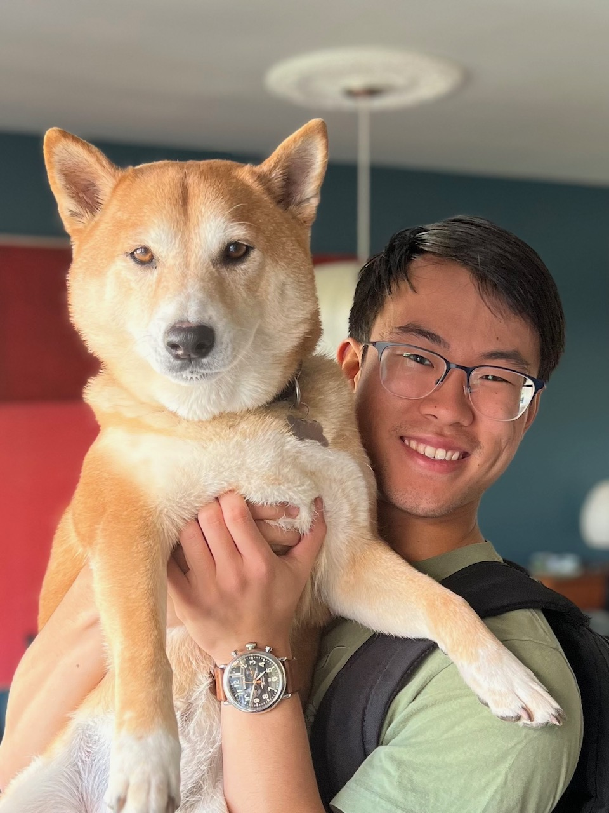

# Nick's Repo
Welcome to my GitHub Repository! Here you can find personal projects of mine, including but not limited to: **programming exercises**, **game demos**, **game mods**, and **various contributions** to other projects!

## About

My name is Nicholas Nakano and I'm currently a 3rd year undergraduate at the University of California, San Diego pursuing a major in Math-Computer Science and a minor in Music. I am also currently an intern with Cynthia.io, a AI and machine learning company. Outside of school and work, my hobbies include automotive racing, playing piano/guitar/saxophone, and drawing! よろしく！

My primary passion in programming lies in C++, especially in its applications to games and software! In addition, I also know C, C#, Java, JavaScript, SQL, and Python. As part of my work with Cynthia.io, I have recently been trying to learn TypeScript and Angular!

## Links
- [LinkedIn](https://www.linkedin.com/in/nicholas-s-nakano/)
- [ArtStation](https://www.artstation.com/nicksnak)
- [Itch.io](https://viridian01.itch.io/)
